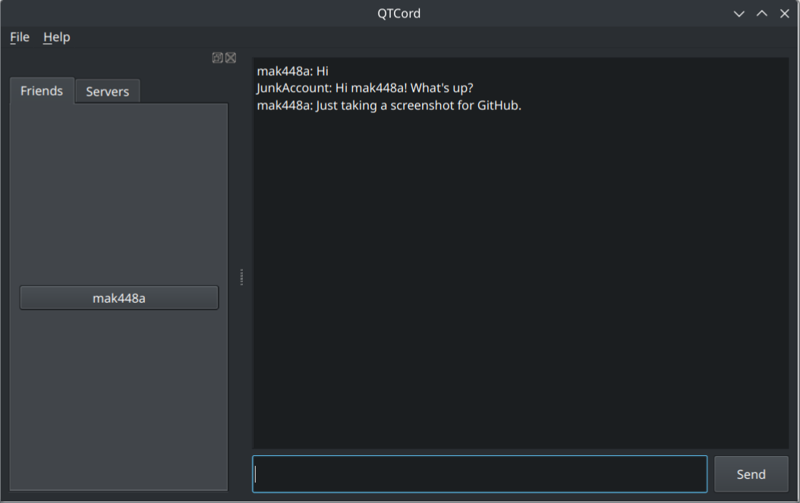

# QTCord
QTCord is a Discord client aiming to bring a native look and feel chat experience. I am not responsible if you get your account banned from this project.
<p style="font-weight:bold;font-size:1.2em">My account has been flagged <em>twice</em> using this project.</p>



## Setup

Do the standard Python procedure:
`python3 -m venv venv`
`source venv/bin/activate`
`pip install -r requirements.txt`

Cd into src
`cd src/`

Afterwards, just run main.py.
```shell
python3 main.py
```

## Notes for developers
The code is a mess, since I'm still working on it. Have fun!
