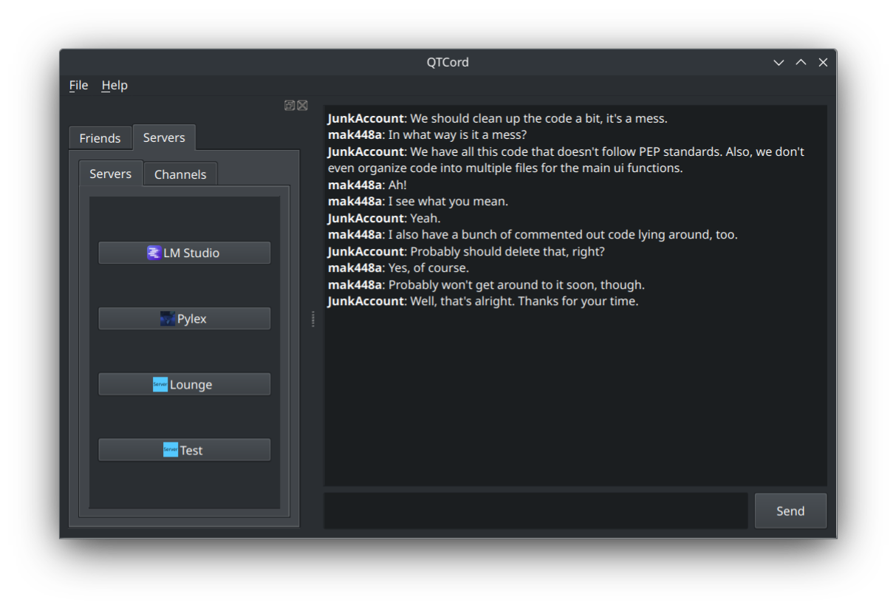

# Qtcord

[](https://discord.gg/gV8SjzZAXj)

Qtcord is a Discord client built with QT aiming to bring a lightweight, native experience. I am not responsible if you get your account banned from this project.

<a href='https://flathub.org/apps/io.github.mak448a.QTCord'>
  
</a>

[Download for Windows](https://github.com/mak448a/Qtcord/releases)
<br>



## Setup

Do the standard Python procedure:
`python3 -m venv venv`
`source venv/bin/activate`
`pip install -r requirements.txt`

Cd into src
`cd src/`

Afterwards, just run main.py.
```shell
python3 main.py
```

## Credits
Here are the links to the tutorials/docs that I used to make this app.
https://discord.com/developers/docs/
https://luna.gitlab.io/discord-unofficial-docs/
https://www.youtube.com/channel/UC8PPJFudLUM1eJlM4BiJ40A

## Notes for developers
The code is a mess, since I'm just working on this for fun. Have fun! And if you're feeling very helpful, maybe even clean it up for me! 😅
Check out CONTRIBUTING.md for more information.
