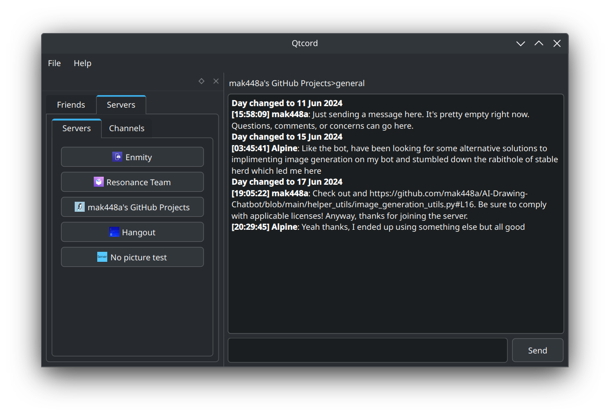

# Qtcord
### A lightweight, native Discord client built with Python and Qt
Qtcord aims to provide a lightweight experience for Discord without the overhead of a webview.

[](https://flathub.org/apps/io.github.mak448a.QTCord)
[](https://discord.gg/gV8SjzZAXj)
[](https://github.com/mak448a/Qtcord/actions/workflows/ci.yml)

---

> [!CAUTION]
> **Use at your own risk.** This is a fun side project. Using unofficial clients is technically against Discord's Terms of Service and *can* lead to your account being banned. I do not endorse or take responsibility for any account actions.

<a href='https://flathub.org/apps/io.github.mak448a.QTCord'>
  
</a>

[Download for Windows & macOS](https://github.com/mak448a/Qtcord/releases/latest)
<br>



## Features
- **Lightweight & Native**: Built with PySide6 (Qt) for a snappy interface.
- **Cross-Platform**: Works on Windows, macOS, and Linux.
- **Privacy Focused**: Runs without telemetry, tracking, or bloat.
- **Work in progress**: Supports servers, direct messages, channels, profile pictures, and server icons.

## Installation
The easiest way to get Qtcord is through the official builds:
(Make sure you're getting Qtcord from the right source! The official source is [mak448a/Qtcord](https://github.com/mak448a/Qtcord)!)

- **Linux**: Get it on [Flathub](https://flathub.org/apps/io.github.mak448a.QTCord) or download the binary from [GitHub Releases](https://github.com/mak448a/Qtcord/releases/latest).
- **Windows & macOS**: Download the latest binaries from [GitHub Releases](https://github.com/mak448a/Qtcord/releases/latest).


## Development
Check out [CONTRIBUTING.md](CONTRIBUTING.md) for coding guidelines and release instructions.
> [!NOTE]
> You need Python 3.12 or higher!
> Also, I recommend using uv if you have it installed. It's faster than pip. (`uv pip install -r requirements.txt`)


If you're on Windows, substitute `python3` for `python`. Do the standard Python procedure:
```bash
python3 -m venv venv
source venv/bin/activate
pip install -r requirements.txt
```

Afterwards, run main.py.
```shell
python3 src/main.py
```

## Credits & Documentation
- [Official Discord API Documentation](https://discord.com/developers/docs/)
- [Unofficial Discord Documentation](https://luna.gitlab.io/discord-unofficial-docs/)
- Special thanks to
  - [nousername-a](https://github.com/randomusername-a) for vastly improving the project's performance and cleaning the code
  - The rest of the contributors
  - The community of developers online
  - Everyone who helped provide feedback
